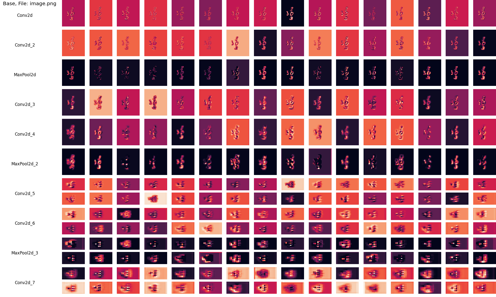
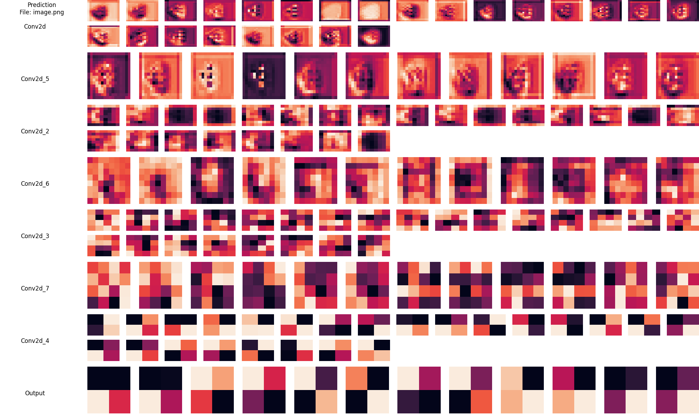

# Visualization of Neural Networks

Welcome to my neural network visualization project. This project aims to visualize any PyTorch neural network to gain insights into their inner workings.

## Examples
**Speech Classifer**<br />
'right' input audio sliced into increasing 10ms intervals. Model from [PyTorch](https://pytorch.org/tutorials/intermediate/speech_command_classification_with_torchaudio_tutorial.html)

https://github.com/Hotrod1220/NN_Visualization/assets/103224887/aa721bc5-f204-4c06-b2d7-3d7bacb8b60e

**Multiple Overlapping Digit Classifier**<br />
Model can be found [here](https://github.com/braycarlson/thesis)
<br />



## Features

- **Independent on network architecture:**
    - Works with FFNs, CNNs, RNNs, LSTMs, etc.
    - Does not work with most transformer networks.
- **Multiple visualization methods:**
    - Choose any combination of visualization methods.
    - Flexible for the addition of new visualization methods.
        - Feel free to share ideas or implement them yourself.
  
## Current Visualization Methods

- **Heatmap:**
  - Visualizes neural network activation layers with a heatmap. Generates a full heatmap for each feature map in each layer.
  - Useful for "fixed" architectures like FFNs and CNNs.
  
- **Heatmaps:**
  - Visualizes neural network activation layers with heatmaps. Generates heatmaps for each layer and saves them onto one figure.
  - Also useful for "fixed" architectures like FFNs and CNNs.
  
- **Heatmap Mining:**
  - Uses data mining and heatmaps to visualize neural network activation layers. Extracts useful data for visualizing activations over all inputs.
  - Choose between different data mining processes.
  - Flexible for the addition of new data mining processes.
    - Feel free to share ideas or implement them yourself.
  - Particularly useful for "continuous" architectures like RNNs and LSTMs.
  - *Still a work in progress*
  
- **Videos:**
  - Transform visualizations into a video.
  - Helpful for dissecting inputs and training of networks.
    - Visualizating the model can done throughout training and made into a video.
    - Future idea: Can overfitting be observed from videos?

## Getting Started
Follow these steps to run the project locally:

*Examples can be found in the examples folder.*

1. **Import and load weights for the model.**
2. **Import the Visualization class and choose visualization methods.**
    - Visualization methods can be found in the visual_methods folder.
3. **Create a list of dictionaries with input data.**
    - Each dictionary can have the following information
    - ‘name’ : str | int | float *Required
    - ‘data’ : tensor | tuple *Required
        - This must be model-ready input, all preprocessing of data must be done before passing it into the Visualization class.
    - ‘labels’ : list
4. **Declare the visualization methods.**
   - Ex: 
        ```python
        visual = Heatmap(Heatmaps())
        ```
   - If HeatmapMining is wanted.
    - Data mining processes can be found in the data_mining folder.
        ```python
        mining = Series() # Data mining process
        visual = HeatmapMining(mining=mining)
        ```
5. **Declare your Visualization object with the model, input(list of dictionaries), and chosen visualization methods.**
6. **Call the visualize() method.**


## Prerequisites

* [pyenv](https://github.com/pyenv/pyenv) or [Python 3.9.5](https://www.python.org/downloads/)


## Setup

### pyenv

```
pyenv install 3.11.2
```

```
pyenv local 3.11.2
```

### Virtual Environment

```
python -m venv venv
```

#### Windows

```
"venv/Scripts/activate"
```

#### Unix

```
source venv/bin/activate
```

### Packages

```
pip install -U -r requirements.txt
```

## License

This project is licensed under the [MIT License](LICENSE).
